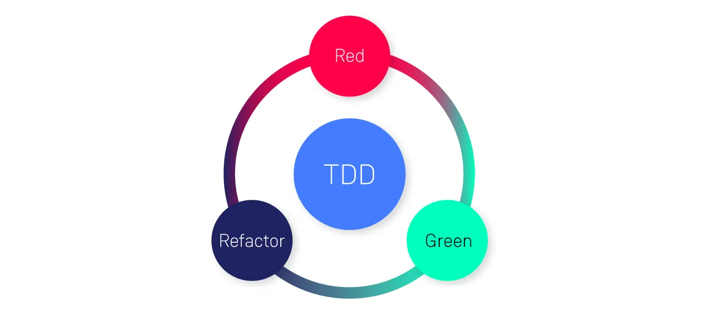

# Criando uma API com FastAPI usando TDD

### O que é TDD?

O **Test-Driven Development** (Desenvolvimento Orientado por Testes ou simplesmenteTDD) é uma metodologia que prioriza a criação de testes antes do código.

Em um ciclo de TDD, você escreve um teste que falhe (Red), implementa o código mínimo para fazê-lo passar (Green) e refatora o código para melhorar sua qualidade (Refactor). O TDD oferece diversos benefícios, como maior qualidade do código, menos bugs, código mais modular e testável e maior confiança no código. Apesar de exigir um investimento inicial de tempo, o TDD pode resultar em software mais robusto, confiável e fácil de manter.

### Projeto Store API

Com o objetivo de trazer conhecimentos sobre TDD e [Fast API](https://fastapi.tiangolo.com/), utilizaremos também o banco de dados [MongoDB](https://www.mongodb.com/docs/manual/), validações com o [Pydantic](https://docs.pydantic.dev/latest/) e testes com [Pytest](https://docs.pytest.org/en/8.0.x/).

### Pré-requisitos

Para este projeto utilizaremos também [Docker](https://docs.docker.com/engine/install/) e [Docker Compose](https://docs.docker.com/compose/install/). Para instalar, basta seguir as instruções presentes na documentação oficial.

### Capítulos

[01. Criação de Ambiente](docs/content/01.md)

[02. Estrutura do Projeto](docs/content/02.md)

[03. Criação do Mongo Client](docs/content/03.md)

[04. Primeiros Testes](docs/content/04.md)

[05. Testes usecases](docs/content/05.md)

[06. Criação de Models](docs/content/06.md)

[07. Testes da Controller e Rotas](docs/content/07.md)

### Conclusão

A adoção do TDD junto ao FastAPI oferece uma abordagem segura e eficiente para o desenvolvimento de APIs. Ao seguir os passos delineados neste artigo, os desenvolvedores podem criar APIs robustas e escaláveis com confiança desde a fase inicial do projeto.

### Créditos

Artigo baseado no projeto apresentado pela profa. [Nayanna Nara](https://www.linkedin.com/in/nayannanara/) (@nayannanara) para o curso [Criando Uma API Com FastAPI Utilizando TDD](https://web.dio.me/lab/tdd-com-python/learning/182318cf-adc7-40b2-b835-e5cf242b482e) da DIO. O repositório original pode ser visitado [aqui](https://github.com/digitalinnovationone/store_api).
